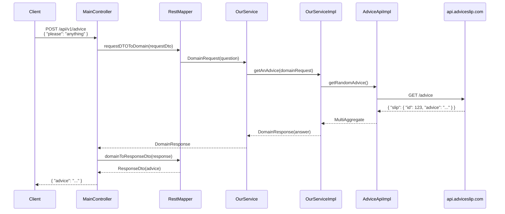

# Architecture Diagram

This document provides a detailed visualization of the multi-module architecture used in this project.

## Architecture Overview

```mermaid
%%{init: {'theme': 'base', 'themeVariables': { 'primaryColor': '#4a90d9', 'edgeLabelBackground':'#ffffff', 'tertiaryColor': '#f5f5f5'}}}%%
graph TB
    subgraph Client["🌐 Client Applications"]
        direction LR
        Swagger[Swagger UI]
        Curl[cURL / HTTP Client]
        Browser[Browser]
    end

    subgraph Inbound["📥 INBOUND LAYER (REST API)"]
        direction TB
        style Inbound fill:#e3f2fd,stroke:#1976d2,stroke-width:2px
        
        subgraph InboundClasses[" "]
            MC[MainController<br/>@RestController]
            RD[RequestDto]
            RE[ResponseDto]
            RM[RestMapper<br/>@Mapper]
            EH[GlobalExceptionHandler]
        end
    end

    subgraph App["⚙️ APPLICATION LAYER"]
        direction TB
        style App fill:#fff3e0,stroke:#f57c00,stroke-width:2px
        
        subgraph AppClasses[" "]
            AppMain[Application<br/>@SpringBootApplication]
            WC[WebClientConfig<br/>WebClient Config]
        end
    end

    subgraph Domain["🎯 DOMAIN LAYER (Pure Business Logic)"]
        direction TB
        style Domain fill:#e8f5e9,stroke:#388e3c,stroke-width:2px
        
        subgraph DomainClasses[" "]
            OS[OurService<br/>Interface]
            DR[DomainRequest<br/>Immutable]
            DRe[DomainResponse<br/>Immutable]
            MA[MultiAggregate<br/>Immutable]
            AA[AdviceApi<br/>Interface]
        end
    end

    subgraph Service["💼 SERVICE LAYER (Implementation)"]
        direction TB
        style Service fill:#fce4ec,stroke:#c2185b,stroke-width:2px
        
        subgraph ServiceClasses[" "]
            OSI[OurServiceImpl<br/>@Service]
        end
    end

    subgraph Outbound["📤 OUTBOUND LAYER (External APIs)"]
        direction TB
        style Outbound fill:#f3e5f5,stroke:#7b1fa2,stroke-width:2px
        
        subgraph OutboundClasses[" "]
            AAI[AdviceApiImpl<br/>@Service]
            AOM[AdviceObjectMapper]
            AR[AdviceResponse]
            ExtAPI[External API<br/>api.adviceslip.com]
        end
    end

    %% Dependency Flow
    Client -->|HTTP Request| Inbound
    Inbound -->|"@RequestBody<br/>Mono<RequestDto>"| MC
    MC -->|"calls"| RM
    RM -->|"maps to"| DR
    MC -->|"uses"| OS
    OS -.->|"implemented by"| OSI
    
    %% Application to Domain
    MC -.->|"via Spring DI"| AppMain
    AppMain -.->|"scans"| WC
    
    %% Service implements Domain
    OSI -->|"injects"| AA
    
    %% Outbound calls
    AAI -->|"HTTP GET"| ExtAPI
    
    %% Data Flow
    DR -.-> OSI
    OSI -->|"returns"| DRe
    DRe -.-> RM
    RM -->|"maps to"| RE
    RE -->|"Mono<ResponseDto>"| MC
    MC -->|"HTTP Response"| Client

    %% Legend
    subgraph Legend["📋 Legend"]
        L1[Interface<br/>Abstract]
        L2[Implementation<br/>Concrete]
    end
    
    L1 -.->|implements| L2

    classDef interface fill:#ffecb3,stroke:#ff6f00,stroke-width:1px,stroke-dasharray:5 5;
    classDef impl fill:#c8e6c9,stroke:#2e7d32,stroke-width:1px;
    classDef dto fill:#bbdefb,stroke:#1565c0,stroke-width:1px;
    
    class OS,AA interface
    class OSI,AAI,MC impl
    class RD,RE,DR,DRe,AR dto
```

## Module Descriptions

### 📥 INBOUND (REST API Layer)
**Location:** `app/inbound/rest/`

This layer handles all incoming HTTP requests and responses. It is the entry point for external clients.

| Component | Responsibility |
|-----------|----------------|
| **MainController** | REST endpoint `/api/v1/advice` - handles POST requests |
| **RequestDto** | Data Transfer Object for incoming requests (JSON) |
| **ResponseDto** | Data Transfer Object for outgoing responses (JSON) |
| **RestMapper** | MapStruct mapper - converts between DTOs and Domain models |
| **GlobalExceptionHandler** | Centralized exception handling |

---

### ⚙️ APPLICATION (Spring Boot Initializer)
**Location:** `app/application/`

This is the bootstrap module that combines all components and initializes the Spring application context.

| Component | Responsibility |
|-----------|----------------|
| **Application** | Main Spring Boot application class with `@SpringBootApplication` |
| **WebClientConfig** | Configuration for reactive WebClient beans |

---

### 🎯 DOMAIN (Pure Business Logic)
**Location:** `app/domain/`

The core of the application - completely vendor-agnostic and free of framework dependencies. Contains pure Java interfaces and immutable domain models.

| Component | Responsibility |
|-----------|----------------|
| **OurService** | Interface defining the business contract |
| **DomainRequest** | Immutable domain model for requests (via Immutables) |
| **DomainResponse** | Immutable domain model for responses (via Immutables) |
| **MultiAggregate** | Immutable aggregate model |
| **AdviceApi** | Interface for outbound communication (port) |

---

### 💼 SERVICE (Implementation Layer)
**Location:** `app/service/`

Contains the actual implementation of domain interfaces and orchestration logic.

| Component | Responsibility |
|-----------|----------------|
| **OurServiceImpl** | Implements `OurService` interface, orchestrates business logic |

---

### 📤 OUTBOUND (External Adapters)
**Location:** `app/outbound/advice-slip-api/`

Integrations with external systems - API clients, repositories, message brokers.

| Component | Responsibility |
|-----------|----------------|
| **AdviceApiImpl** | Implements `AdviceApi` interface, calls external Advice Slip API |
| **AdviceObjectMapper** | Maps external API response to domain models |
| **AdviceResponse** | Model representing external API response |
| **External API** | [api.adviceslip.com](https://api.adviceslip.com/) - public advice API |

---

## Data Flow Example



## Dependency Direction

```
┌─────────────────────────────────────────────────────┐
│                    inbound                           │
│  (MainController, RequestDto, ResponseDto,         │
│   RestMapper, GlobalExceptionHandler)               │
└──────────────────────┬──────────────────────────────┘
                       │
                       ▼
┌─────────────────────────────────────────────────────┐
│                   application                        │
│  (Application, WebClientConfig)                     │
└──────────────────────┬──────────────────────────────┘
                       │
               Uses/Imports
                       ▼
┌─────────────────────────────────────────────────────┐
│                     domain                           │
│  (OurService, DomainRequest, DomainResponse,        │
│   MultiAggregate, AdviceApi)                        │
└──────────────┬──────────────┬───────────────────────┘
               │              │
  implements   │          implements
               ▼              ▼
┌─────────────────────────────────────────────────────┐
│                    service                          │
│  (OurServiceImpl)                                    │
│                        │                             │
│          depends on │                               │
│                        ▼                             │
│                    outbound                          │
│  (AdviceApiImpl, AdviceObjectMapper,                │
│   AdviceResponse, External API)                     │
└─────────────────────────────────────────────────────┘
```

**Key Rule:** Dependencies point inward - domain defines interfaces, service and outbound implement them.

## Technology Stack

- **Java 17+** with Reactive programming (Project Reactor)
- **Spring Boot 3.5.x** - Application framework
- **Lombok** - Code generation
- **MapStruct** - Object mapping
- **Immutables** - Immutable domain models
- **Spring WebFlux** - Reactive REST API
- **WebClient** - Non-blocking HTTP client (outbound)

---

*Last updated: 2026-03-10*