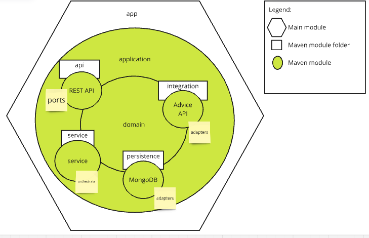

# multi-module-architecture
This project is a multi module maven code sample that is inspired by clean architecture and hexagonal architecture, but is it's own kind of breed.

Explaining this image, notice the surrounding module folder named f.ex "service", this is what clean architecture would name "usecase".
"persistence" is what would be called "adapter" in the hexagonal architecture pattern.
The main purpose is to split code in such a way, that a developer will keep the strict separation and only connect modules through domain interfaces.
Implementations of said interfaces are done in the respective modules, so that "service" module consist of the orchestration beans, that is the logic and collection of domain data.

# Usage
Starting the application through an IDE like [IntelliJ][10] use spring profile `local`

## Entrypoint(ports)
The application has a REST API contract which can be accessed through the address `http://localhost:8081/swagger-ui.html`

# Build
During build, [lombok][20] needs to be enabled to do preprocessing
Build the project like any other maven build with `mvn clean package`

# Integration(adapters)
The integration to the public [Advice API][50] is done through REST calls.

The services from the maven module for advice API is only available through a domain interface and all object models from the external API
is maintained in the integration module, only to be mapped into the domain model made available for all other maven modules through domain module.

[10]: https://www.jetbrains.com/idea/
[20]: https://projectlombok.org/
[50]:https://api.adviceslip.com/#top
