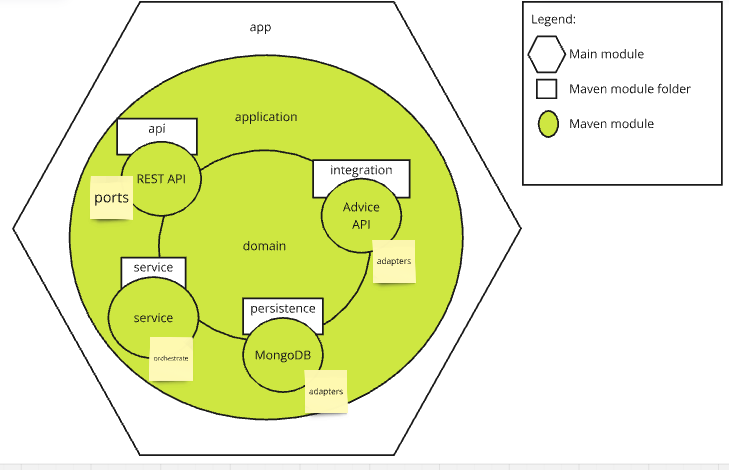

# multi-module-architecture

[](https://github.com/jnie/multi-module-architecture)
[](https://maven.apache.org/)
[](https://www.java.com/)
[](https://spring.io/projects/spring-boot)


## Architecture Overview

This project follows a modular architecture that separates concerns across distinct layers inspired by Clean Architecture and Hexagonal Architecture patterns. 
This demonstrates a practical implementation of domain-driven design with clear separation of concerns.



## Quick Start

```bash
# Clone the repository
git clone https://github.com/jnie/multi-module-architecture.git
cd multi-module-architecture

# Build the project
mvn clean install

# Run the application
mvn spring-boot:run -pl app/application
```

## Technology Stack

| Technology | Version | Purpose |
|------------|---------|---------|
| Java | 17+ | Programming language |
| Spring Boot | 3.5.11 | Application framework |
| Maven | 3.9+ | Build tool |
| Lombok | Latest | Code generation |
| MapStruct | 1.6.3 | Object mapping |
| Springdoc OpenAPI | 2.8.15 | API documentation |
| H2 Database | Latest | In-memory database |
| Reactor | Latest | Reactive programming |

## 🎯 Purpose

- Demonstrate that multi-module architecture is **framework-agnostic**
- Showcase Micronaut's advantages: **faster startup**, **lower memory usage**
- Provide a **reference implementation** for Spring Boot → Micronaut migrations

## 📦 Architecture

The project follows a **Clean Architecture** approach with clear separation of concerns:

```
app/
├── inbound/rest/          # REST controllers, DTOs, mappers
├── application/           # Main class, configuration, beans
├── domain/                # Domain models, interfaces (business logic contracts)
├── service/               # Business logic implementation and Orchestration layer
└── outbound/              # External adapters (HTTP clients, repositories)
    └── advice-slip-api/   # Integration with Advice Slip API
```

### Module Responsibilities

| Module | Description                                                                     |
|--------|---------------------------------------------------------------------------------|
| **inbound/rest** | REST controllers, DTOs, exception handling                                      |
| **application** | Entry point (Application.main), configuration, dependency wiring                |
| **domain** | Business models, interfaces (contracts) for services, no framework dependencies |
| **service** | Orchestration and business logic, implements domain services                    |
| **outbound/advice-slip-api** | External API integration (HTTP client)                                          |

## Constraints for module dependencies
- inbound/rest cannot depend on any other module than Domain
- application depends on all modules to wire the full application
- domain cannot depend on any other module
- service cannot depend on any other module than Domain
- outboudn/*api* cannot depend on any other module than Domain

## Object mapping for modules
- domain module is responsible for the domain objects and aggregates
- outbound/*api* is responsible for mapping from domain model to external contract (API) and back to internal domain model
- inbound/*api* is responsible for the mapping from API consumers(external parties of application services) to the domain model and back
- repository is responsible for mapping from domain models to repositories as databases and back to domain models when returning
- service layer should ONLY handle domain model objects, never do any mapping from or to other external models

## Usage

### Running in IDE

1. Import the project as a Maven project in IntelliJ IDEA or your preferred IDE
2. Select the `app/application` module as the main module
3. Run with Spring profile `local`

### Running from Command Line

```bash
# Build all modules
mvn clean package

# Run the application
mvn spring-boot:run -pl app/application -Dspring-boot.run.profiles=local
```

### Accessing the Application

The REST API is available at: `http://localhost:8081/swagger-ui.html`

## API Endpoints

| Method | Endpoint | Description |
|--------|----------|-------------|
| GET | `/api/v1/advices` | Get all advice slips |
| GET | `/api/v1/advices/random` | Get a random advice slip |
| GET | `/api/v1/advices/{id}` | Get advice by ID |
| POST | `/api/v1/advices/search` | Search for advice by keyword |
| GET | `/api/v1/advices/search/{query}` | Search for advice (GET variant) |

## Integration

### Advice Slip API

This project integrates with the public [Advice Slip API](https://api.adviceslip.com/) to demonstrate how to consume external REST APIs.

Key implementation details:
- External API models are isolated in the `app/outbound/advice-slip-api` module
- Domain models are used throughout the application
- All external data is mapped to domain models before being used by business logic

## Why This Architecture

### Benefits

1. **Separation of Concerns**: Each module has a clear responsibility, making the codebase easier to understand and maintain.
2. **Testability**: Business logic in the domain layer can be tested without any external dependencies.
3. **Flexibility**: External integrations can be swapped without affecting core business logic.
4. **Maintainability**: Changes to one module have minimal impact on others.
5. **Reactive Support**: Built on Spring WebFlux for reactive, non-blocking operations.

## License

This project is available for learning and demonstration purposes.
