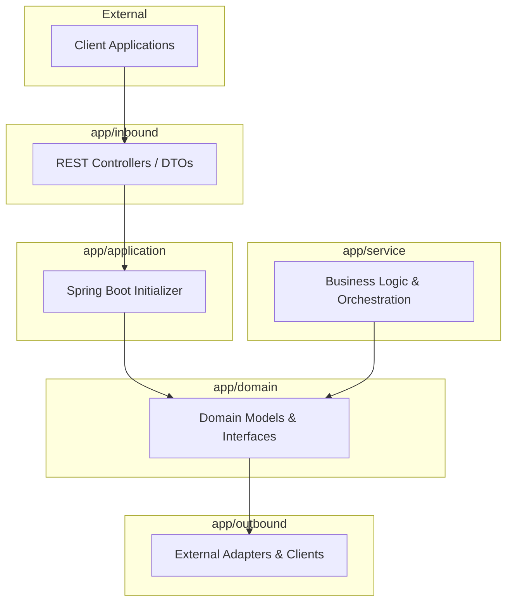

# multi-module-architecture

[](https://github.com/jnie/multi-module-architecture)
[](https://maven.apache.org/)
[](https://www.java.com/)
[](https://spring.io/projects/spring-boot)

A multi-module Maven project inspired by Clean Architecture and Hexagonal Architecture patterns. This project demonstrates a practical implementation of domain-driven design with clear separation of concerns.


## Quick Start

```bash
# Clone the repository
git clone https://github.com/jnie/multi-module-architecture.git
cd multi-module-architecture

# Build the project
mvn clean package

# Run the application
mvn spring-boot:run -pl app/application
```

## Architecture Overview

This project follows a modular architecture that separates concerns across distinct layers:


```mermaid
graph TB
    subgraph External
        Client[Client Applications]
    end
    
    subgraph "app/inbound"
        REST[REST Controllers / DTOs]
    end
    
    subgraph "app/application"
        Bootstrap[Spring Boot Initializer]
    end
    
    subgraph "app/domain"
        Models[Domain Models & Interfaces]
    end
    
    subgraph "app/service"
        Business[Business Logic & Orchestration]
    end
    
    subgraph "app/outbound"
        Adapters[External Adapters & Clients]
    end
    
    Client --> REST
    REST --> Bootstrap
    Bootstrap --> Models
    Business --> Models
    Models --> Adapters
```

## Module Structure

| Module | Description | Responsibility |
| --------------- | ----------------------------- | ------------------------------------------------------------ |
| app/inbound | REST controllers, DTOs | Receives external requests |
| app/application | Used as Springboot initializer | Combines and initializes bean context |
| app/domain | Domain models, interfaces | Core-Businesslogic (vendor-agnostic) |
| app/service | Business logic implementation | Actual implementation of domain interfaces and Orchestration |
| app/outbound | External adapters | Integration with external systems (API clients, persistence) |

### Module Details

- **app/inbound**: Contains REST controllers and Data Transfer Objects (DTOs). This layer handles incoming HTTP requests and responses.
- **app/application**: Acts as the Spring Boot initializer. Combines and initializes the bean context for the entire application.
- **app/domain**: Contains domain models and interfaces. This is the core business logic layer, completely vendor-agnostic.
- **app/service**: Implements the domain interfaces and contains orchestration logic. This is where business rules are enforced.
- **app/outbound**: Contains external adapters for integration with third-party systems, including API clients and persistence layer implementations.

## Technology Stack

| Technology | Version | Purpose |
|------------|---------|---------|
| Java | 17+ | Programming language |
| Spring Boot | 3.5.11 | Application framework |
| Maven | 3.9+ | Build tool |
| Lombok | Latest | Code generation |
| MapStruct | 1.6.3 | Object mapping |
| Springdoc OpenAPI | 2.8.15 | API documentation |
| H2 Database | Latest | In-memory database |
| Reactor | Latest | Reactive programming |

## Usage

### Running in IDE

1. Import the project as a Maven project in IntelliJ IDEA or your preferred IDE
2. Select the `app/application` module as the main module
3. Run with Spring profile `local`

### Running from Command Line

```bash
# Build all modules
mvn clean package

# Run the application
mvn spring-boot:run -pl app/application -Dspring-boot.run.profiles=local
```

### Accessing the Application

The REST API is available at: `http://localhost:8081/swagger-ui.html`

## API Endpoints

| Method | Endpoint | Description |
|--------|----------|-------------|
| GET | `/api/v1/advices` | Get all advice slips |
| GET | `/api/v1/advices/random` | Get a random advice slip |
| GET | `/api/v1/advices/{id}` | Get advice by ID |
| POST | `/api/v1/advices/search` | Search for advice by keyword |
| GET | `/api/v1/advices/search/{query}` | Search for advice (GET variant) |

## Integration

### Advice Slip API

This project integrates with the public [Advice Slip API](https://api.adviceslip.com/) to demonstrate how to consume external REST APIs.

Key implementation details:
- External API models are isolated in the `app/outbound/advice-slip-api` module
- Domain models are used throughout the application
- All external data is mapped to domain models before being used by business logic

## Why This Architecture

### Benefits

1. **Separation of Concerns**: Each module has a clear responsibility, making the codebase easier to understand and maintain.
2. **Testability**: Business logic in the domain layer can be tested without any external dependencies.
3. **Flexibility**: External integrations can be swapped without affecting core business logic.
4. **Maintainability**: Changes to one module have minimal impact on others.
5. **Reactive Support**: Built on Spring WebFlux for reactive, non-blocking operations.

## Build Instructions

### Prerequisites

- Java 17 or higher
- Maven 3.9 or higher

### Building

```bash
# Clean and build
mvn clean package

# Skip tests
mvn clean package -DskipTests

# Build specific module
mvn clean install -pl app/domain
```

### Lombok Configuration

During build, Lombok must be enabled for preprocessing. This is configured in the Maven compiler plugin.

## License

This project is available for learning and demonstration purposes.
